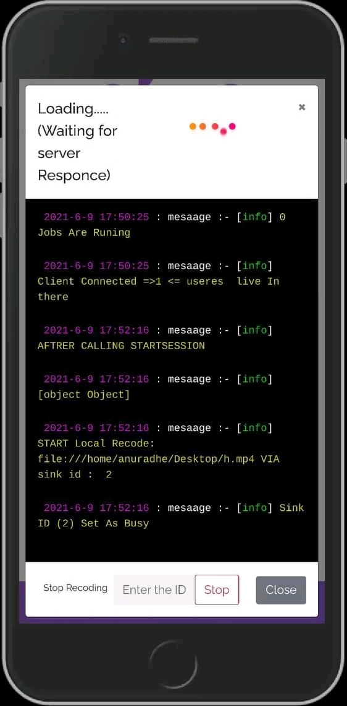
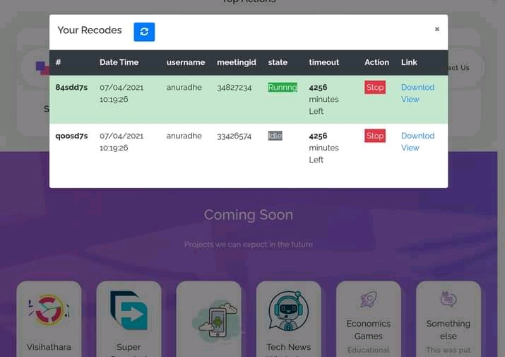
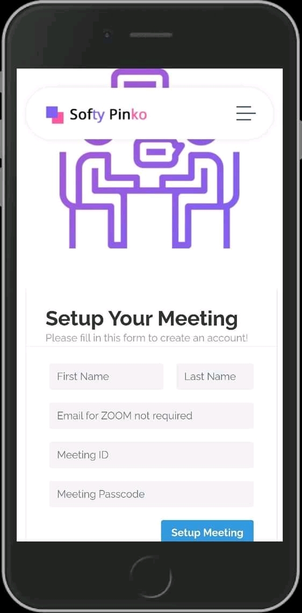

# Cloud_based_zoomrecoder  :joy_cat:

{:height="36px" width="36px"}




####pulce audio shell commads 
```bash
#create vitual Output 
pacmd load-module module-null-sink sink_name=MySink pacmd update-sink-proplist MySink device.description=MySink

#set Loopback 
pacmd load-module module-loopback sink=MySink

#Change to null source 
pacmd load-module module-null-source sink=My_Fake

remove module 
#pactl unload-module [name|clienid |``]

#find Ids 
pactl unload-module

#List All sink _ outputsDevices 
pactl list short sinks

#list Inputs 
pacmd list-sink-inputs

#get Sink Name Only sinks 
pactl list |grep 'Name' | sed 's/^.*: //'

#Get Number Of Sink 
pactl list sinks |grep -c 'Sink #'

#Get Id Of sinks 
pactl list short sinks | sed 's/[ \t]([0-9]{1,})./\1/'
```

---------------------------------------------------------------------------------------------


##### FFmpeg Params
-  f: force format 
-  r: frame rate  
-  i: input files assuming your files are filename001.jpg, filename002.jpg, ... 
-  vcodec: video codec 
-  crf: constant rate factor (0-51). 17-18 is (nearly) visually lossless. See Encode/H.264 //   pix_fmt: pixel format

##### VLC Capture stream
vlc tcp://@127.0.0.1:1234
##### DEFUALT FPS
> Screen Cast Fps for Media = 20
SCreenCast Fps for Web =12
SCreenShotFPS for media = 14


------------
#####SEND to PIPELINE stdin
```javascript
client.send("Page.startScreencast", { format: 'jpeg', everyNthFrame: 1, });
ffmpeg = await FFmpegLauncher.start(params, local); client.on("Page.screencastFrame", (d) => {

if (ffmpeg && ffmpeg.stdin) {

  try {
    let buff = Buffer.from(d.data, 'base64');
    ffmpeg.stdin.write(buff);
   
  } catch (error) {
    console.log("ERRORR  @ ", error);
  }


}
client.send("Page.screencastFrameAck", { sessionId: d.sessionId });

} );

```

------------


##### Func
```javascript
async function setup() { 
page.target()._targetId this.EndPoint = await this.chrome.launchChrome(); try { const forLoop = async _ => {
            for (let index = 0; index < this.max; index++) {
                logger.log("SETUPING", index);
                var id = await this.chrome.new_page(test[index]);
                await this.timeout(5000);
                var inputs = await this.pulce.getInputId(Chrome.processId);
                var inId = this.find_Large(inputs);
                var page = Chrome.get_page(id);
                this.pages[index] = id;
                page.TargetID = page.target()._targetId;
                page.AInId = inId;
                var sinkId = await this.pulce.createSink("Sink_Name-" + index);
                logger.log(id, sinkId);
                this.sinks[index] = sinkId;
                page.SinkID = "Sink_Name-" + index;
                logger.log(page.SinkID);
                await this.pulce.moveInput(inId, sinkId);
            }
            return Promise.resolve("SDS");
        }
        return forLoop();
    }
    catch (e) {
        this.installingError(e)
    }
}
```

